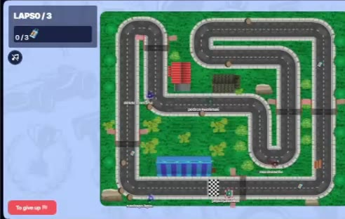

# RaceGame

A real-time, top-down multiplayer racing game for **up to 10 players** on the same track, playable in the browser. Built in three weeks (Oct–Nov 2024) by a team of 4 at [Alpha EdTech](https://www.alphaedtech.org.br/), a non-profit code academy in São José dos Campos, Brazil.



A clip of a 10-player test match is in [`edi.mp4`](edi.mp4). The full write-up, with an architecture diagram, is in the [case study](https://portfolio-carlomorais.vercel.app/en/projects/racegame).

## How it works

- **The server is the source of truth.** The browser only sends which keys are pressed. The server runs the game loop at **30 ticks per second**, applies speed and steering physics, collisions with track walls, checkpoints, laps and pickups (nitro), and decides where every car is. No one can "teleport" a car from the console.
- **Client-side prediction with reconciliation.** Your own car runs the same physics locally, so it answers the arrow keys without waiting for the network. Every move is numbered; when the server state arrives, the client compares by move number and only corrects the position if the two disagree.
- **Interpolation for opponents.** Other cars aren't predicted: each frame they cover part of the distance to their last known position, which removes the jitter between updates.
- **Only send what changed.** The server compares position, speed and rotation with the previous tick, so a car that isn't moving produces no message.
- **WebSocket without Socket.IO.** The [`ws`](https://github.com/websockets/ws) library on the server and the browser's native WebSocket API, with a typed TypeScript message contract on both sides.

```
Browser (React + Canvas)                 Server (Node.js + Express)
  client game loop  ── keys ──────────▶   WebSocket (ws)
  prediction        ◀── state ─────────   game loop · 30 ticks/s
  screens & lobby   ◀── HTTP ──────────▶  REST API · sign-in (JWT cookie, Google OAuth)
                                            ├── PostgreSQL (users, cars)
                                            └── Redis (live rooms)
```

## Stack

TypeScript · React · HTML5 Canvas · Node.js · Express · ws · PostgreSQL (Knex) · Redis · Passport (Google OAuth) · JWT · Docker Compose · Nginx · Certbot

## Running it

Requires **Docker** with Docker Compose. Copy `backend/.env.example` to `backend/.env` and `frontend/.env.example` to `frontend/.env`, then fill in your values (Google OAuth credentials are needed for Google sign-in).

### Development

```bash
docker compose -f docker-compose.dev.yml build
docker compose -f docker-compose.dev.yml up
```

- Frontend (React): http://localhost:80
- Backend (API): http://localhost:5000

Docker Compose can be flaky during the build; if it fails, restart Docker and try again. To run the backend or the frontend on their own, see [`docs/backend.md`](docs/backend.md) and [`docs/frontend.md`](docs/frontend.md).

### Production

```bash
docker compose -f docker-compose.prod.yml build
docker compose -f docker-compose.prod.yml up -d
```

Then issue the SSL certificate with Certbot (replace the domain with yours, already pointed at the server's IP):

```bash
docker compose -f docker-compose.prod.yml run --rm certbot certonly --webroot --webroot-path=/var/www/certbot -d your.domain.com
```

The frontend is served by Nginx at your domain over HTTPS; the API listens on port 5000.

## Team

| Who | What |
| --- | --- |
| Carlos Eduardo Araujo Morais | Project lead; game engine (server and client game loops, prediction, interpolation), most of the WebSocket server, production Docker Compose and Nginx |
| Pedrosavioo | Lobby and WebSocket server |
| Murilo Russo Netto | Authentication, repositories and rooms in Redis |
| Lígia Abreu | Screens and UI components |

More docs (Git conventions, links) are in [`docs/`](docs).
